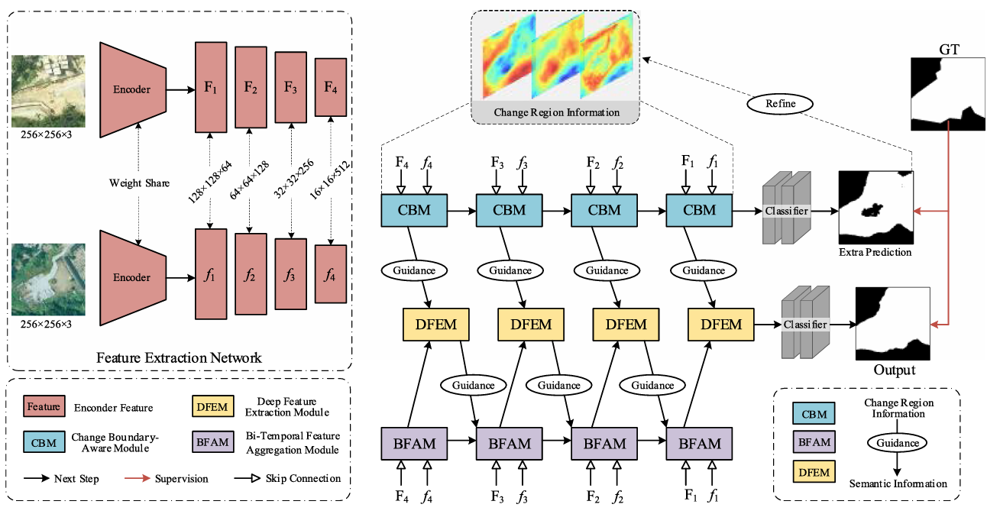
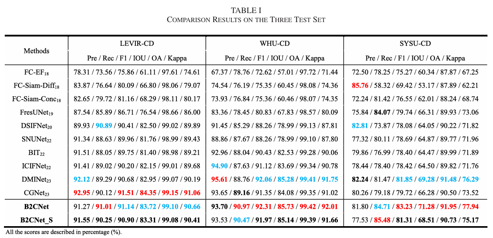

# B2CNet: A Progressive Change Boundary-to-Center Refinement Network for Multitemporal Remote Sensing Images Change Detection
- Code for the paper: "B2CNet: A Progressive Change Boundary-to-Center Refinement Network for Multitemporal Remote Sensing Images Change Detection", JSTARS 2024. [[IEEE JSTARS]](https://ieeexplore.ieee.org/document/10547405)

Methods
-----------------


Quantitative Comparison
-----------------


### :speech_balloon: Dataset Preparation

### :point_right: Data structure

```
"""
Change detection data set with pixel-level binary labels；
├─A
├─B
└─label
"""
```

`A`: images of t1 phase;

`B`: images of t2 phase;

`label`: label maps;

# Citation
```shell
@ARTICLE{10547405,
  author={Zhang, Zhiqi and Bao, Liyang and Xiang, Shao and Xie, Guangqi and Gao, Rong},
  journal={IEEE Journal of Selected Topics in Applied Earth Observations and Remote Sensing}, 
  title={B2CNet: A Progressive Change Boundary-to-Center Refinement Network for Multitemporal Remote Sensing Images Change Detection}, 
  year={2024},
  volume={17},
  number={},
  pages={11322-11338},
  doi={10.1109/JSTARS.2024.3409072}}
```
